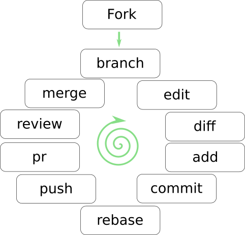

# Git workshop - Open Source Methods and Flow

Hello,

A colleage of mine crafted this little training for people new to open source methods and
tools. This was part of "Open Source Day" at the customer he work with, now its reused 
as a workshop of it's own. This allows you to practice how your
teams could utilize open source management of code, configs or docs, using
the typical methods based around Git version control.

At the end of the session everyone should be able to understand and work
via typical open source methods, sharing and collaborating.

In this exercise we build a travel guide. Nothing serious, but something
easy to grasp for everyone. We create it as open source, and crowd source
the content using git. Each participant takes part, no coding skills needed.

So think of a holiday, summer/winter/skiing/diving whatever. In your city,
country, continent, planet or planetary system. Anything, content doesn't
matter. Anyone can think of a place you'd recommend others to visit or
to avoid :)

We collect the stories into [travelguide.md](travelguide.md) file. An easier
method is to just collect them as separate files from participants i.e. yourName_travelguide.md into this
git repository.

# Prerequisites


1. Participant, I recommend to install git into your workstation.
   In linux it's available via your systems packet manager(dnf/apt install git). 
   In windows I know some use [git for windows](https://git-scm.com/download/win). 
   On a Mac Git is preinstalled with latest OS, or you can Brew install git for mac. 
   You can also use graphical git tools such as [GitHub Desktop](https://desktop.github.com/)
2. If you use a good hosted git portal (gitlab/github/gogs/gitea) they come
   with editors and issue trackers, and you don't need to install a client.


# Exercise workflow for the participant

So with this idea, let's go through the steps of a typical git workflow:



1. Fork or clone this repo (take a copy)
2. Create branch for your idea (feature branch) or fix to an existing idea
   (bugfix branch)
3. Create new or update existing files as you see fit.
3a. Easy: Add a new file (eg. my_traveguide.md) with your recommendation.
3b. Advanced: Edit the travelguide.md file with your changes. 
4. Commit changes to your git repository
5. Take in the changes others have done in meanwhile, and tidy up your version
   (rebase)
6. Push you commits to public version control (your fork or branch)
7. Create Pull Request for acceptance of your changes
8. Review the changes with auditors
9. Your changes will be accepted and added, or marked for needing further
   enhancements.
10. If accepted, smile and be happy, you just contributed to travel book!
    If you got denied, go to step 3 and enhance the contribution, and work
    through the review again.

## Useful commands during exercise

If you go to command line, here are some typical commands needed:

* To get help on git commands ```git help clone```
* Copy the code to your workstation: ```git clone <url>```
* Create your own branch ```git switch -c my_story```
* Add file, or add changes ```git add <file>```
* See your changes ```git diff [origin/main]```
* See directory status ```git status```
* Commit file into version control ```git commit -m "my city"```
* Tidy up changes, pull other peoples' changes
  ```git fetch origin; git rebase -i origin/main```
* Push changes to git portal ```git push```

And when stuff goes wrong with git, [dangit!](https://dangitgit.com/)

# Git Workflow models


Workflows in Git are guidelines and not structured rules defining methods on how to work and collaborate with git. 
There are several types of workflows,logic is common and various tools differ just a bit. Workflows are normally based on common 
guidenlines and then tailored to a spcific organizations or teams needs. 

* [Git Organized](https://render.com/blog/git-organized-a-better-git-flow)
* [GitFlow - Atlassian](https://www.atlassian.com/git/tutorials/comparing-workflows/gitflow-workflow)
* [Forking - Atlassian](https://www.atlassian.com/git/tutorials/comparing-workflows/forking-workflow)
* [GitLab Flow](https://docs.gitlab.com/ee/topics/gitlab_flow.html)
* [GitHub Flow](https://docs.github.com/en/get-started/quickstart/github-flow)

Also see [this](https://martinfowler.com/articles/branching-patterns.html) blog from Martin Fowler for useful information 
on patterns for managing source code branches


# End of the day

Everyone should now have an idea how your organization can work together as a
an open team structure, being the team physical or virtual team. This simple
exercise prepares you to work efficiently together.

Be polite, be accepting. Embrace collaboration!

Have a good session, and reach out to me for questions or comments!

BR,

Mikael Diwing
mdiwing@redhat.com
